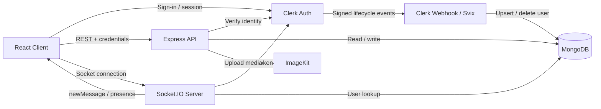

# InstaChat

> A production-minded full-stack real-time messaging application built with React, Node.js, MongoDB, Clerk, Socket.IO, and ImageKit.

[](https://react.dev/)
[](https://nodejs.org/)
[](https://expressjs.com/)
[](https://www.mongodb.com/)
[](https://socket.io/)
[](https://clerk.com/)
[](https://vitejs.dev/)

## Overview

InstaChat is a full-stack one-to-one messaging platform designed around the interaction model of a modern desktop/mobile chat client.

The application combines:

- Clerk authentication and user identity management
- MongoDB persistence through Mongoose
- Express REST APIs for users, conversations, and message history
- Socket.IO for real-time message delivery and online presence
- ImageKit for hosted image/video media
- React 19 + Vite for the client application
- Zustand for client-side application state
- HeroUI + Tailwind CSS for the interface system
- Persistent theme, accent, wallpaper, and sound preferences
- Signed Clerk/Svix webhooks for synchronizing authentication identities into the application database

The project is intentionally more than a chat UI. Its implementation includes defensive upload handling, readiness-aware health checks, race-condition protection around conversation loading, client-side persistence boundaries, and explicit separation between identity-provider data and application-level user records.

---

## Product Capabilities

### Messaging

- One-to-one conversations
- Text messaging
- Image attachments
- Video attachments
- Conversation list ordered by most recent activity
- Message history ordered chronologically
- Date separators such as `Today`, `Yesterday`, and formatted calendar dates
- Automatic scroll-to-latest-message behavior
- Message timestamps

### Real-Time Experience

- Socket.IO-based message delivery
- Online-user presence tracking
- Conversation updates after new messages
- Per-conversation subscription management
- Client-side protection against stale conversation requests overwriting newer state

### Authentication & Identity

- Clerk authentication on the frontend
- Clerk middleware on the backend
- Backend route protection using the authenticated Clerk user ID
- Local MongoDB user profile synchronized from Clerk
- Signed webhook verification using Svix
- User create/update/delete lifecycle handling

### Media

- Image and video uploads
- 25 MB upload limit
- MIME allow-list at upload time
- File-signature validation based on actual file bytes
- Temporary disk storage before remote upload
- Private temporary upload directory with restrictive permissions on non-Windows systems
- ImageKit-hosted media
- ImageKit transformation URLs for optimized image/video delivery
- Automatic temporary-file cleanup after success or failure

### UI / UX

- Responsive desktop/mobile chat layout
- Light and dark themes
- Multiple accent-color presets
- Wallpaper selection
- Persisted interface preferences
- Search across conversations and users
- Online/offline avatar indicators
- Keyboard-style typing sounds with a user-controlled mute toggle
- Accessible labels for icon controls and screen-reader status text

---

## Architecture



### Request / Data Flow

#### Authentication flow

```text
User
  │
  ▼
Clerk UI / session
  │
  ▼
React app
  │ GET /api/auth/check
  ▼
Clerk middleware
  │
  ▼
protectRoute
  │ lookup clerkId
  ▼
MongoDB User
  │
  ▼
Authenticated application user
```

#### Clerk synchronization flow

```text
Clerk
  │ user.created / user.updated / user.deleted
  ▼
/api/webhooks
  │ raw request body
  ▼
Svix signature verification
  │
  ▼
User.findOneAndUpdate / User.findOneAndDelete
  │
  ▼
MongoDB application profile
```

#### Message flow

```text
Sender Client
   │
   │ POST /api/messages/send/:recipientId
   ▼
Express + protectRoute
   │
   ├── Validate recipient
   ├── Validate uploaded file signature
   ├── Upload image/video to ImageKit
   └── Persist Message in MongoDB
          │
          ├── HTTP response → Sender
          │
          └── Socket.IO emit("newMessage") → Receiver
```

---

## Repository Structure

```text
InstaChat-main/
├── backend/
│   ├── src/
│   │   ├── controllers/
│   │   │   ├── auth.controller.js
│   │   │   └── message.controller.js
│   │   ├── db/
│   │   │   ├── db.js
│   │   │   └── models/
│   │   │       ├── Message.js
│   │   │       └── User.js
│   │   ├── lib/
│   │   │   ├── cron.js
│   │   │   ├── imagekit.js
│   │   │   └── socket.js
│   │   ├── middleware/
│   │   │   ├── auth.middleware.js
│   │   │   └── upload.middleware.js
│   │   ├── routes/
│   │   │   ├── auth.route.js
│   │   │   └── message.route.js
│   │   ├── seeds/
│   │   │   └── user.seed.js
│   │   ├── webhooks/
│   │   │   └── clerk.webhook.js
│   │   └── index.js
│   └── package.json
│
├── frontend/
│   ├── public/
│   │   ├── sounds/
│   │   └── wallpapers/
│   ├── src/
│   │   ├── components/
│   │   │   ├── auth/
│   │   │   └── chats/
│   │   ├── context/
│   │   ├── data/
│   │   ├── hooks/
│   │   ├── lib/
│   │   ├── pages/
│   │   ├── stores/
│   │   ├── styles/
│   │   ├── App.jsx
│   │   └── main.jsx
│   ├── package.json
│   └── vite.config.js
│
└── .gitignore
```

The backend follows a lightweight layered structure: routes define the HTTP surface, middleware handles authentication and upload validation, controllers coordinate application logic, and the `lib`/`db` modules encapsulate infrastructure concerns.

The frontend separates presentation components from global state, contexts, hooks, static configuration, and transport helpers.

---

## Technology Stack

| Layer | Technology | Responsibility |
|---|---|---|
| Frontend | React 19 | Component-driven UI |
| Build | Vite 8 | Development server and production bundling |
| Routing | React Router | Client-side route protection/navigation |
| UI | HeroUI | Accessible interactive UI primitives |
| Styling | Tailwind CSS 4 | Layout, responsive styling, theming |
| State | Zustand 5 | Auth/chat application state |
| HTTP | Axios | REST API communication |
| Real-time | Socket.IO 4 | Message delivery and presence |
| Backend | Node.js + Express 5 | HTTP API and application runtime |
| Database | MongoDB + Mongoose 9 | User and message persistence |
| Auth | Clerk | Identity, sessions, authentication |
| Webhooks | Svix | Signed Clerk event verification |
| Media | ImageKit | Remote image/video storage and transformation |
| Uploads | Multer | Controlled temporary multipart handling |
| Scheduling | node-cron | Production health-check ping |

---

## Data Model

### User

```text
User
├── _id
├── clerkId      unique
├── email        unique
├── fullName
├── profilePic
├── createdAt
└── updatedAt
```

The application deliberately stores its own user profile keyed by `clerkId` instead of treating Clerk as the application's primary persistence layer.

### Message

```text
Message
├── _id
├── senderId     → User._id
├── receiverId   → User._id
├── text
├── image
├── video
├── createdAt
└── updatedAt
```

A message can contain text, image media, video media, or a combination of text and media.

---

## API Surface

All message endpoints are protected by `protectRoute`.

### Authentication

| Method | Endpoint | Purpose |
|---|---|---|
| `GET` | `/api/auth/check` | Resolve the authenticated application user |

### Messaging

| Method | Endpoint | Purpose |
|---|---|---|
| `GET` | `/api/messages/users` | Get all users except the current user |
| `GET` | `/api/messages/conversations` | Get users with whom the current user has messages, ordered by latest activity |
| `GET` | `/api/messages/:id` | Get the full two-way message history with a user |
| `POST` | `/api/messages/send/:id` | Send a text/image/video message |

### Health

| Method | Endpoint | Purpose |
|---|---|---|
| `GET` | `/health` | Readiness-aware application health check |

The health endpoint returns `503` until the MongoDB connection is ready and `200` with `{ "ok": true }` afterwards.

### Webhooks

| Method | Endpoint | Purpose |
|---|---|---|
| `POST` | `/api/webhooks` | Process verified Clerk user lifecycle events |

The webhook endpoint deliberately receives the raw `application/json` body so Svix can verify the exact signed payload.

---

## Real-Time Events

### Server → Client

| Event | Payload | Purpose |
|---|---|---|
| `getOnlineUsers` | `string[]` | Current connected application-user IDs |
| `newMessage` | Message document | Push a newly persisted message to the recipient |

The backend maintains an in-memory `userSocketMap` keyed by the MongoDB user ID.

```text
Mongo User ID ──────────► Socket.IO socket.id
       │                         │
       └──────────── send ───────┘
```

For a single-instance deployment, this is sufficient for lightweight presence and direct message delivery. A multi-instance deployment would require a shared presence/message transport such as a Socket.IO adapter backed by Redis or another distributed coordination layer.

---

## Media Upload Pipeline

The media path is intentionally defensive:

```text
Browser
  │ multipart/form-data
  ▼
Multer
  │ max 25 MB
  │ image/video allow-list
  ▼
Temporary file
  │
  ▼
Byte-signature validation
  │
  ├── JPEG / PNG / GIF / WebP / BMP
  └── MP4 / WebM / AVI
  │
  ▼
ImageKit
  │
  ▼
Public media URL
  │
  ▼
MongoDB Message
```

The backend does not trust the client-provided MIME type. It reads the file header and replaces the MIME value with the detected type before continuing.

Temporary files are removed both after ImageKit upload and along error paths, avoiding accumulation of stale files on the application host.

---

## State Management Strategy

The frontend splits state into two principal Zustand stores.

### `useAuthStore`

Owns:

- authenticated application user
- authentication-check state
- online-user IDs
- Socket.IO connection lifecycle

### `useChatStore`

Owns:

- user directory
- conversation list
- active conversation
- message history
- search/filter state
- sidebar tab
- composer state
- media-upload state
- sound preference

Only the sound preference is persisted through Zustand's `persist` middleware. Authentication and server-derived chat data remain runtime state rather than being blindly persisted into local storage.

### Race-condition protection

Rapidly switching between conversations can produce overlapping `getMessages()` requests. The store uses a monotonic request sequence to ensure only the latest request may update messages, loading state, or error UI.

```js
const requestId = ++messagesRequestSeq;

// ... request resolves later

if (requestId !== messagesRequestSeq) return;
```

This prevents an older, slower request from replacing the currently selected conversation with stale results.

---

## Theming & Personalization

The application treats personalization as application state rather than hard-coded styling.

### Theme

- System theme detection
- Light/dark mode
- Persisted theme choice
- Accent presets including Sky, Lavender, Mint, Netflix, Uber, Spotify, Coinbase, Airbnb, Discord, and Rabbit

### Wallpapers

- Local wallpaper catalog
- Category-based picker
- Persisted wallpaper selection
- Responsive thumbnail grid
- Lazy-loaded wallpaper assets

### Sound

- Four bundled keyboard sound effects
- Randomized keypress sound selection
- Per-user mute toggle
- Persisted sound preference

These concerns are isolated into dedicated contexts, hooks, and static data modules rather than being embedded directly into chat components.

---

## Security & Reliability Considerations

The implementation includes several protections that are easy to overlook in a prototype:

### Authentication boundaries

The REST API does not trust a client-supplied application user object. `protectRoute` derives the Clerk identity from the authenticated request and resolves the matching MongoDB user profile.

### Webhook verification

Clerk webhook events are verified using the Svix signing secret and the complete raw request body before database mutations occur.

### File validation

The upload layer combines:

- extension-independent MIME checks
- a 25 MB size limit
- allowed image/video MIME prefixes
- file-header signature inspection
- sanitized ImageKit filenames
- restricted temporary-file directory permissions
- cleanup on success and failure

### Recipient validation

Message sends validate that the supplied MongoDB recipient ID is syntactically valid and corresponds to an existing user before persisting the message.

### Readiness-aware health checks

The application only reports healthy once MongoDB has connected. In production, a cron job pings the public `/health` endpoint every 14 minutes to reduce the risk of an idle host being suspended by infrastructure that aggressively reclaims inactive services.

---

## Environment Variables

### Backend

Create `backend/.env`:

```env
PORT=8001
NODE_ENV=development
FRONTEND_URL=http://localhost:5173
API_URL=http://localhost:8001

MONGODB_URI=mongodb+srv://<username>:<password>@<cluster>/<database>

CLERK_JWT_KEY=<clerk-jwt-verification-key>
CLERK_WEBHOOK_SECRET=<clerk-webhook-signing-secret>

IMAGEKIT_PRIVATE_KEY=<imagekit-private-key>
```

### Frontend

Create `frontend/.env`:

```env
VITE_CLERK_PUBLISHABLE_KEY=<clerk-publishable-key>
```

> Never commit `.env` files or server-side secrets. In particular, `CLERK_JWT_KEY`, `CLERK_WEBHOOK_SECRET`, `MONGODB_URI`, and `IMAGEKIT_PRIVATE_KEY` belong exclusively on the backend.

---

## Local Development

### Prerequisites

- Node.js with npm
- MongoDB database
- Clerk application
- ImageKit account for media messaging

### 1. Clone the repository

```bash
git clone https://github.com/Ayyah-Coded/InstaChat
cd InstaChat
```

### 2. Install backend dependencies

```bash
cd backend
npm install
```

### 3. Configure backend environment

Create `backend/.env` using the variables shown above.

### 4. Install frontend dependencies

```bash
cd ../frontend
npm install
```

### 5. Configure frontend environment

Create `frontend/.env`:

```env
VITE_CLERK_PUBLISHABLE_KEY=<your-clerk-publishable-key>
```

### 6. Start the backend

```bash
cd ../backend
npm run dev
```

The development API runs on the configured `PORT` and defaults to `8001` in the frontend configuration.

### 7. Start the frontend

In another terminal:

```bash
cd frontend
npm run dev
```

Vite serves the frontend on its normal development port, typically `http://localhost:5173`.

---

## Database Seeding

The repository includes a development seed script that inserts or updates sample user profiles.

```bash
cd backend
npm run db:seed
```

The seed uses `bulkWrite` with upserts, making repeated runs safe for the provided seed identities.

These records are intended for development/demo data and should not be treated as real production identities.

---

## Clerk Webhook Configuration

Configure a Clerk webhook pointing to:

```text
POST https://<your-backend-domain>/api/webhooks
```

The handler currently supports:

- `user.created`
- `user.updated`
- `user.deleted`

The endpoint expects the standard Svix headers:

```text
svix-id
svix-timestamp
svix-signature
```

and verifies them before touching the database.

---

## Deployment Model

The application is structured for a split frontend/backend deployment or a setup where the frontend is served behind the same origin as the backend.

### Development

```text
Frontend: http://localhost:5173
Backend:  http://localhost:8001
```

The Axios client points at `/api` in production and the Socket.IO client resolves against the application base URL.

### Production checklist

Before deploying, configure:

- production MongoDB URI
- Clerk production keys and webhook secret
- ImageKit private key
- production frontend origin
- API public URL for the health-check cron
- CORS origin
- HTTPS
- secure secret management
- a shared Socket.IO adapter if running multiple backend instances

---

## Production Hardening Notes

The codebase already contains several production-oriented decisions, but a larger deployment would benefit from a few additional infrastructure changes.

### Horizontal Socket.IO scaling

`userSocketMap` is process-local. With multiple API instances, a user may connect to one process while another process receives a message that needs to be delivered to that user.

A production multi-instance topology should introduce a shared Socket.IO adapter, typically Redis-backed, and a distributed presence model.

### Socket authentication consistency

The server-side Socket.IO middleware expects a Clerk token in the Socket.IO handshake's `auth.token` field and verifies it with `clerkClient.verifyToken()`. The current browser connection code establishes the socket with a `query.userId` value instead. These two mechanisms should be aligned before treating the real-time channel as production-ready; the client should obtain a Clerk session token and send it through the handshake `auth` payload.

### Observability

For higher-scale environments, add structured logging, request IDs, metrics, centralized error tracking, and connection/message telemetry.

### API protections

Rate limiting, request validation schemas, structured error contracts, and explicit authorization rules can further strengthen the public HTTP boundary.

### Message indexing

As message volume grows, indexes on sender/receiver and creation time can improve conversation-history and sidebar queries.

---

## Engineering Highlights

### 1. Identity-provider / application-data separation

Clerk owns authentication while MongoDB owns the application's user profile. The synchronization boundary is explicit and event-driven through signed webhooks.

### 2. Defensive media processing

The application does not equate a browser-supplied MIME value with a trustworthy file type. File bytes are inspected before remote storage, reducing the attack surface of the upload endpoint.

### 3. Race-safe conversation fetching

The frontend explicitly models the asynchronous nature of conversation switching and rejects stale request results rather than relying on timing luck.

### 4. Runtime-only server-derived state

Chat messages, users, and conversations are fetched from the server rather than being persisted indiscriminately in local storage. Only a small set of UI preferences is persisted.

### 5. Infrastructure-aware readiness

The `/health` endpoint distinguishes a healthy application from a process that is alive but has not successfully initialized its database connection.

### 6. Media delivery optimization

Images and videos are transformed through ImageKit rather than blindly delivering original media dimensions to the client.

---

## Operational Commands

### Backend

```bash
npm run dev       # Development with Node watch mode
npm start         # Production-style startup
npm run db:seed   # Seed/update development users
```

### Frontend

```bash
npm run dev       # Vite development server
npm run build     # Production build
npm run lint      # ESLint
npm run preview   # Preview production build locally
```

---

## Testing & Quality Gates

The repository currently exposes linting on the frontend, but it does not contain a dedicated automated unit/integration/e2e test suite in the checked-in source.

For a production extension, the highest-value tests would cover:

1. Clerk webhook signature verification and lifecycle synchronization
2. `protectRoute` behavior for missing, unsynced, and valid identities
3. message authorization and recipient validation
4. upload MIME/signature validation and cleanup paths
5. conversation aggregation ordering
6. stale-request behavior in `useChatStore`
7. Socket.IO authentication, message delivery, and presence transitions
8. responsive chat flows through browser-level end-to-end tests

---

## Design Principles

The project follows a few recurring engineering principles:

- **Trust boundaries are explicit.** Authentication, webhook verification, and file validation happen at the server boundary.
- **Server state stays server-owned.** MongoDB and the APIs remain authoritative for messages and user data.
- **UI state is isolated.** Zustand, contexts, and hooks keep presentation components from owning application-wide coordination.
- **Asynchrony is treated as a correctness problem.** Request sequencing and cleanup paths are handled deliberately.
- **Infrastructure concerns are modularized.** Database, media, scheduling, sockets, middleware, and webhooks live outside controllers and pages.
- **The interface is treated as a system.** Theme presets, wallpaper selection, responsive layout, accessibility labels, and persisted preferences are organized as reusable primitives rather than one-off styles.

---

## Why This Project Is Interesting

InstaChat demonstrates the transition from a simple CRUD messaging application to a system that has to reason about authentication boundaries, real-time communication, asynchronous UI state, file handling, third-party integrations, and deployment behavior simultaneously.

The strongest engineering signal is not any individual library. It is the way the application composes those concerns:

```text
Identity
  +
REST API
  +
MongoDB persistence
  +
Real-time transport
  +
Media pipeline
  +
Client state management
  +
Reliability safeguards
  =
A cohesive end-to-end product
```

---

## License

---

## Author

I'm Yahaya H., I build a full-stack engineering project to explore real-time systems, authentication architecture, media pipelines, resilient client state management, and polished product UX.
